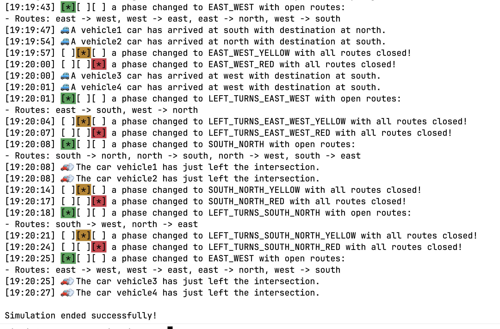

# Traffic lights

Projekt symulacji ruchu drogowego na skrzyżowaniu w czasie rzeczywistym.

## Uruchamianie

Po zainstalowaniu wszystkich zależności należy wykonać polecenie:

```console
tsx src/interactive.ts f presets/sample.json
```

W tym przypadku zostanie uruchomiona interaktywna symulacja `presets/sample.json`, jest ona uruchomiona w trybie `f` &mdash; 
`fast forward`, czyli w przyśpieszeniu. Domyślnie jest to 5x krotne przyśpieszenie. Symulacja bazuje na czasach, które można
zaobserwować na prawdziwych skrzyżowaniach, dlatego tryb `f` jest wygodny do testowania. Podanie opcji `r` (lub dowolnego ciągu znaków)
uruchomi symulację w tempie domyślnym.

Aby przetestować działanie kontraktu API, należy jednak wykonać polecenie:

```console
tsx src/main.ts presets/sample.json output.json
```

Ten skrypt w odróżnieniu od symulacji interaktywnej zwróci wynik bez opóźniania. Więcej informacji o implementacji obu symulacji
znajduje się w sekcji [Algorytm](#algorytm). 

Poniżej przedstawiam przykładowy przebieg symulacji w trybie interaktywnym dla pliku `presets/sample.json`.




## Algorytm

### Interpretacja polecenia

Format danych wejściowych API był dla mnie małym zaskoczeniem &mdash; wydaje się, że zakłada pewną dyskretyzację zdarzeń.
Mam na myśli założenie, że auta pojawiają się jak gdyby jednocześnie, a potem znikają w krokach, komendach `step`.
Przez brak pojęcia czasu, sygnalizacja świetlna staje się związana ze stanem aut. 

Postarałem się uczynić ten system bardziej atrakcyjnym. Rozwiązanie działa w czasie rzeczywistym. Wydaje się, że
pozwala to na prostą rozbudowę, np. światła reagujące na informację o dojeżdżających autach w dokładnym momencie (np. `19:57:03`).

Auta dojeżdżają do skrzyżowania w kolejności zadanej w pliku wejściowym. Czas pomiędzy kolejnymi dojazdami jest wyliczany na podstawie
dystrybuanty rozkładu wykładniczego. Parametr $\lambda$ jest przyjęty jako stała, liczba aut dojeżdżająca na skrzyżowanie
na sekundę.

- `src/timing.ts` &mdash; plik z wyznaczaniem kolejnych odstępów między autami.

Rozkład wykładniczy dobrze modeluje czas pomiędzy przyjazdami kolejnych aut &mdash; możliwe są chwilowe zagęszczenia
i rozrzedzenia ruchu. W taki sposób zasymulowałem upływ czasu rzeczywistego dla danych dyskretnych.

Takie rozwiązanie można bardzo łatwo przenieść na model strumieniowy, w którym otrzymujemy dane 
w poszczególnych cząstkach (jak byłoby przy czujkach na skrzyżowaniu), np. fragment kodu z `src/simulation.ts`:

```typescript
for (const command of preset.commands) {
    await delaySeconds(ff(poissonDistributionDistance()));
    // ...
}
```

możemy zamienić na asynchroniczne przetwarzanie:

```typescript
const someCommandStream = getCommandStream();

for await (const command of someCommandStream) {
    // Brak potrzeby sztucznego opóźniania, pętla asynchroniczna
    // ...   
}
```

Wprowadzę teraz kilka definicji, których używam w programie, następna część związana bezpośrednio z algorytmem wyznaczania
długości cykli znajduje się w sekcji [Metoda Webstera](#metoda-webstera).

### Model skrzyżowania

Za model skrzyżowania przyjąłem wersję przedstawioną w artykule "A Survey on Traffic Signal Control Methods" [^1] &mdash; standardowe skrzyżowanie północ, południe
wschód, zachód z wyróżnionymi pasami dla każdego skrętu (lewo, prawo, prosto). W prosty sposób można odnieść taki
model do dowolnego, rzeczywistego układu pasów, pamiętając o modyfikacji kolejek na poszczególne połączenia 
(np. prawoskręty na tym samym pasie, co auta jadące prosto).

### Podział na fazy

Sygnalizacja świetlna opiera się o fazy. Faza może składać się z jednego lub kilku otwartych połączeń drogowych, 
np. `północ -> południe`, `południe -> północ`. W danej fazie wszystkie możliwe połączenia nie kolidują ze sobą.
W przypadku skrzyżowania dwóch dróg (cztery drogi dojazdowe) z możliwością jazdy w każdym kierunku, potrzebujemy minimum czterech 
faz w danej sekwencji. 

Mamy pewną swobodę w doborze faz, w przeglądzie "A Survey on Traffic Signal Control Methods" [^1], autorzy proponują fazy
`wschód -> zachód`, `zachód -> wschód`, następnie lewoskręty `wschód -> północ`, `zachód -> południe`. Faza trzecia jest
analogiczna `północ -> południe`, `południe -> północ` i wreszcie czwarta  `północ -> zachód`, `południe -> wschód`. Warto
zauważyć, że autorzy przyjmują, że prawoskręty są dozwolone w każdej fazie. Przyjęta w projekcie konwencja dodaje
prawoskręty do konkretnych faz &mdash; z `północy na południe` i `ze wschodu na zachód` (te oznaczenia wyglądają jak połączenia,
ale jak wcześniej zaznaczyłem, dana faza światła może składać się z wielu połączeń).

**Ciekawostka** Na znanym mi skrzyżowaniu ulic Piastowskiej z Armii Krajowej, przyjęto jeszcze inną konwencję czterofazową.
Połączenie wschodnio-zachodnie (`wschód -> zachód`, `zachód -> wschód`) dzieje się jednocześnie, natomiast połączenie
`północ -> południe` i `południe -> północ` mają sygnalizację zieloną w innych fazach.

.")

### Metoda Webstera

Metoda Webstera pozwala na obliczenie optymalnych długości cykli świateł dla pojedynczego skrzyżowania. Opiera
się na danych historycznych ze skrzyżowania, tzn. musimy znać średnią liczbę aut przejeżdżającą w każdym kierunku
w zadanym interwale czasowym (standardowo godzinie). W zasadzie istotna jest tylko wartość maksymalna takiego
wskaźnika dla danej fazy.

Ponieważ obłożenie poszczególnych połączeń zmienia się w zależności od godziny (poranne, szczytu, wieczorne), to
często w praktyce liczy się optymalne cykle w zależności od pory dnia i tak programuje kontrolery.

Aby zastosować tę metodę nie znając historycznych danych o autach, zastosowałem pewien trik. Pierwotnie miałem porównać
wydajność cyklu o stałych (np. równych fazach) do długości cykli wyznaczonych przez algorytm Webstera. W tym celu
symulacje przetwarzają cały plik wejściowy komend. Auta na poszczególnych połączeniach stanowią te historyczne dane, 
po kilku przekształceniach i skalowaniach (do jednostki auta/godzinę), otrzymujemy dość akuratne dane do wzoru.

- `src/webster/webster.ts` &mdash; implementacja metody Webstera, w pliku także objaśnienie stosowanych parametrów,
- `src/webster/fixed-time-plan.ts` &mdash; adapter danych wejściowych na potrzebne we wzorze dane historyczne skrzyżowania (funkcja `prepareCriticalVolumes`); w tym pliku także znajduje się kod maszyny stanu.

### Maszyna stanu

Sygnalizacja świetlna jest symulowana przez maszynę stanu. Korzystam tutaj z biblioteki `xstate`. Wyróżniłem dwanaście
stanów dla maszyny, cztery na fazy główne oraz 8 na fazy przejściowe (światło żółte i czerwone) zdefiniowane w pliku `src/webster/phase.ts`.
Koncepcyjnie jest to najprostsze oraz niezawodne rozwiązanie. Poszczególne czasy przejść biorę z równania Webstera, korzystając
jednak ze zdefiniowanego minimum `MIN_GREEN_TIME_IN_SECONDS`. Wartości parametrów starałem się dobierać m.in. na podstawie
podręcznika "Signal Timing Manual" [^2].

W szczególności obsługuję stan, w którym wszystkie światła są czerwone (`all-red period`), jest to dodatkowy bufor bezpieczeństwa.
Podsumowując, każda z czterech faz, ma dodatkowo dwie fazy przejściowe. Pozwala to na dość intuicyjne wyświetlenie informacji
w trybie interaktywnym &mdash; wszystkie połączenia w danej fazie mają to samo światło, więc wystarczy pokazać jedynie sygnalizację obsługiwanej fazy.
Połączenia, które nie należą do obecnej fazy, mają sygnalizację światła czerwonego. To tak à propos implementacji graficznej tego rozwiązania.

### Symulacja interaktywna

Funkcja symulacji interaktywnej zdefiniowana jest w pliku `src/simulation.ts`. Z ciekawszych rzeczy można zaznaczyć, że
przechowuję aktualne kolejki dla każdego połączenia. Gdybyśmy chcieli, aby jeden pas obsługiwał parę połączeń, auta musiałyby
dzielić tę samą kolejkę. Zakładam, że odstęp pomiędzy przejazdami kolejnych aut wynosi dwie sekundy. Wszystko jest konfigurowalne
przez odpowiednie stałe zdefiniowane w programie (`src/traffic-constants.ts`).

Komenda typu `step` w wypadku systemu czasu rzeczywistego zwraca auta, które w aktualnej fazie przejechały przez skrzyżowanie. Aby uniknąć
dziwnych artefaktów, przy kilku komendach `step` w tej samej fazie, komenda zwraca tylko nowe auta.

### Dyskretyzacja systemu czasu rzeczywistego

Aby dopasować mój system czasu rzeczywistego do zadanego API, użyłem zegara `SimulatedClock`. Pozwoliło to
wykorzystać wcześniej zdefiniowaną maszynę. Tym razem jednak dla uproszczenia ustawiłem stałą `TICK` na `1`, a czas
poszczególnych faz ustawiłem na wartość liczbową wyrażoną w sekundach. Pojęcie czasu w takim systemie jest inne, więc
fazy przejściowe (żółte, czerwone) trwają jedną jednostkę `TICK`. Istnienie faz przejściowych będzie jednak tworzyło
bloki pustych statusów. Założyłem, że w systemie dyskretnym, to właśnie `step` posuwa czas do przodu. 

Dopasowanie do tego API pozwoliło mi jednak na pewną optymalizację, jeśli w aktualnej fazie nie ma czekających aut, to
symulacja przejdzie do następnej fazy (m.in. pozwala to uniknąć czekania np. 30 kroków w 1 fazie). Myślę, że możemy
nazwać to sygnalizacją pół-inteligentną.


## Pomysły na dalszą rozbudowę systemu

Podczas researchu nad tym projektem przeczytałem kilka artykułów, szczególnie ciekawe są pomysły:

- Możliwe jest dostosowanie metody Webstera, żeby dostosowywała się do aktualnego ruchu na skrzyżowaniu, działałoby to na zasadzie ponownego liczenia wzoru w zadanych oknach (15-minutowych). Następnie nowy plan byłby stopniowo aplikowany, zmieniając długości poszczególnych faz.
- Implementacja ciekawszych metod typu `Actuated-control`, czyli takich, ktore bezpośrednio reagują na każdy impuls pojawiającego się samochodu.
- Największym zainteresowaniem obecnie cieszą się metody oparte o uczenie maszynowe. Zagadnienie jest na pewno ciekawe, wykraczające jednak poza zakres tego projektu.

### Testy wydajności

Pierwotnie chciałem zaimplementować większą liczbę metod zarządzania światłami i porównać ich parametry. W zasadzie jest wiele parametrów, które
można by było sprawdzić np. średni czas oczekiwania kierowców, czy maksymalną przepustowość skrzyżowania (aut/godzinę). 
Jak to jednak bywa w systemach czasu rzeczywistego (jak życie), czas płynie. Tym razem udało mi się zrobić tyle, ile tutaj Państwu prezentuję.

---

[^1]: *A Survey on Traffic Signal Control Methods*: https://arxiv.org/abs/1904.08117.
[^2]: National Academies of Sciences, Engineering, and Medicine: *Signal Timing Manual (Second Edition)*, FHWA-HOP-15-024, https://www.google.com/url?sa=t&source=web&rct=j&opi=89978449&url=https://ops.fhwa.dot.gov/publications/fhwahop08024/fhwa_hop_08_024.pdf&ved=2ahUKEwjmyLbzqr6TAxU2hP0HHdK1M-UQFnoECB0QAQ&usg=AOvVaw3Whtlw7wjSXeOufvDTV0JF.
